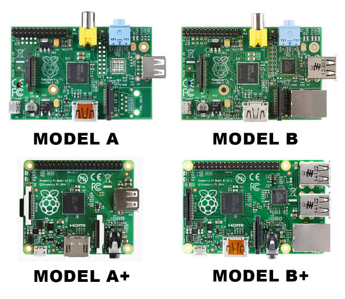
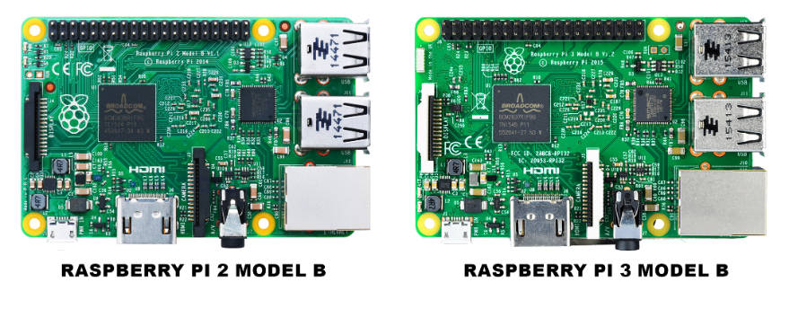

# Introduction
These are my notes to install a full blown mean stack (MongoDB, Express, Angular 4+, Node 8+) on the Raspberry Pi. I keep these notes to be able to quickly set up, or reinstall my environment. 

# Table of Contents
0. [Approach Vector](#approach-vector)
1. [Setup](#setup)
2. [Hardware](#hardware)
3. [Operating System](#operating-system)
4. [MongoDB](#mongodb)
5. [Node](#node)
6. [Angular](#angular)
7. [Building](#building)
8. [Serving](#serving)
9. [QEMU](#qemu)
10. [Cheat Sheets](#cheat-sheets)

# APPROACH VECTOR

My personal goals: 

* Improve on my full-stack javascript skills by practise
* Prove small and medium companies can benefit from smart solutions with the same functionalties as a full blown ERP or CRM (like Oracle, Microsoft,Salesforce, Workday, SAP etc)
* Redefine the current solution stack: VMWare images (virtualization) running Windows, that run Java (virtualization) that run packaged applications that need to interconnect with different packaged applications via middleware using webservices to create composit applications (virtualization)... Why not one solution for all processes?

This project's goal: Create a platform to minimize cost and powerusage and maximize flexibility, performance and usability.

## The project's offering:

Back to [Table of Contents](#table-of-contents)

Via the web:

                            U:\    +---------------+
        +-------------------+  +----> sFTP netdrive +-----------+      proxy.conf
        | Visual Studio Code|  |    +---------------+           |      +-----+
        |                   +--+   +------------+   4200        |      |     |
        +-------------------+      |    Putty   +--------+-----------------------+
        | Windows 10        +------> ssh tunnel |        |      |      |     |   |
        |                   |      +------------+     +--v------+--+---v-----+---v-+
        +-------------------+                         | ssh  |sFTP | Node |webpack |
                                                    +------------+---------------+         +------------+
                                                    |          File System       +--------->Github.com  |
                                                    +----------------------------+         |            |
                                                    |         Raspberry pi       |         +------------+
                                                    |                            |
                                                    |                            |
                                                    +----------------------------+
Via LAN:

                              +-----+------+-----+
    +------------------+      | SMB | MEAN | git |        +------------+
    |Visual Studio Code|      +-----+------+-----+        |Github.com  |
    +------------------+      |   File System    +-------->            |
    | Windows 10       |      +------------------+        +------------+
    +------------------+------>   Raspberry Pi   |
                              +------------------+

* Strengths: Robust, easy to set up
* Weaknesses: You need to be able to connect to the Pi, either carry it around using a UTP cross-cable with bridged network, or carry around a switch or hub if you are using an open network. It just doesn't work in my office so my Pi sits at home accessable via port forwarding.

## Alternatives

I have also tried the following offerings:

### Local MEAN stack

Back to [Table of Contents](#table-of-contents)

    +----------------------------------+
    |Visual Studio Code                |
    +----------------------------------+
    | Windows 10                       |
    |                     +------+-----+
    |                     | MEAN | git |
    +---------------------+------+-----+
    | File System                      |
    +----------------------------------+

* Strengths: not so easy to set up
* Weaknesses: rebuilding takes a lot of time, test data on local db, need to run servers locally

### Local Git repository

Back to [Table of Contents](#table-of-contents)

                                            +--------+
                              +-----+------+-v---+    |
    +------------------+      | SMB | MEAN | git +----+
    |Visual Studio Code|      +-----+------+-----+
    +------------------+      |   File System    |
    | Windows 10       |      +------------------+
    +------------------+      |   Raspberry Pi   |
                              +------------------+

* Strengths: private code
* Weaknesses: If I want to rebuild by Pi, I need additional backup steps

### Virtual Pi

Back to [Table of Contents](#table-of-contents)

I have tried to use QEMU for a virtual Pi however it is extremely slow because of the mem cap of 256MB of the kernel.

    +----------------------------------+
    |Visual Studio Code                |
    +----------------------------------+
    | Windows 10                       |
    |             QEMU                 |
    |             +-----+------+-----+ |
    |             | SMB | MEAN | git | |
    |             +-----+------+-----+ |
    |             |   File System    | |
    |             +------------------+ |
    |             |   Raspberry Pi   | |
    |             +------------------+ |
    +----------------------------------+

* Strengths: Easy backup (7z the image file), easy distribution, no hardware required, portable, no messing around with connectivity issues
* Weaknesses: extremely slow

### Cloud

Back to [Table of Contents](#table-of-contents)

Not yet tried cloud, as my own hosting provider doesn't support node, only PHP. Maybe I'll switch to Heroku, AmazonWS, Google Cloud Platform... in near future. But still I need to have a dev/test environment. These offerings cost money...

Graphics created via [asciiflow.com](http://asciiflow.com/) 

## SETUP

Back to [Table of Contents](#table-of-contents)

* Raspberry pi: ehm... *model 3 Model B* (see [Pi](#pi) hardware information in [Sources](#sources))
* Network: wired
* Mode: headless (no monitor, nor keyboard)
* OS: Raspbian Jessy
* Features: Latest MEAN (MongoDB, Express, Angular 4+, Node 8+), Samba, Git

# HARDWARE

Back to [Table of Contents](#table-of-contents)

The Raspberry Pi is a series of small single-board computers developed in the United Kingdom by the Raspberry Pi Foundation to promote the teaching of basic computer science in schools and in developing countries. The original model became far more popular than anticipated, selling outside of its target market for uses such as robotics. Peripherals (including keyboards, mice and cases) are not included with the Raspberry Pi. Some accessories however have been included in several official and unofficial bundles.
According to the Raspberry Pi Foundation, over 5 million Raspberry Pis have been sold before February 2015, making it the best-selling British computer. By November 2016 they had sold 11 million units. [source](https://en.wikipedia.org/wiki/Raspberry_Pi)

The latest model in 2017 is the Pi3. I personally like the Pi in general because smart people put a lot of effort in optimizing the computer board to reduce not only the costs, but indirectly also optimizing squeezing as much as computing power in small circuits. Also there are no moving parts (no fan, no spinning harddisk). The cpu doesn't need cooling, so less power consumption. Also it runs of 5V, so I can power the board from my USB connection. Also there are many applications for the board and the information is all accross the web.

The Pi uses a differt CPU than a plain PC, this is why you are unable to run Windows 10 from a single board. Not sure about a [Pi cluster](http://www.zdnet.com/article/build-your-own-supercomputer-out-of-raspberry-pi-boards/). The CPU used in the Pi is ARM (Advanced RISC Machine). RISC is Reduced Instruction Set Computing, while an x86 processor is CISC (Complex Instruction Set Computing).

Complex Instruction Set Computer (CISC) processors, like the x86, have a rich instruction set capable of doing complex things with a single instruction. Such processors often have significant amounts of internal logic that decode machine instructions to sequences of internal operations (microcode).
RISC architectures, in contrast, have a smaller number of more general purpose instructions, that might be executed with significantly fewer transistors, making the silicon cheaper and more power efficient. Like other RISC architectures, ARM cores have a large number of general-purpose registers and many instructions execute in a single cycle. It has simple addressing modes, where all load/store addresses can be determined from register contents and instruction fields. [source](http://infocenter.arm.com/help/index.jsp?topic=/com.arm.doc.den0013d/index.html)

The core difference between those in this aspect is that ARM instructions operate only on registers with a few instructions for loading and saving data from / to memory while x86 can operate on directly memory as well. Up until v8 ARM was a native 32 bit architecture, favoring four byte operations over others.
So ARM is a simpler architecture, leading to small silicon area and lots of power save features while x86 becoming a power beast in terms of both power consumption and production. [source](https://stackoverflow.com/questions/14794460/how-does-the-arm-architecture-differ-from-x86)

|  Type | A-1 | A-1+ | B 1 | B 1+ | B 2 | B 2 v 1.2 | B 3 | CM 1 | CM 3 | CM 3 Lite | Zero 1.2 | Zero 1.3 | Zero W |
|  ------ | ------ | ------ | ------ | ------ | ------ | ------ | ------ | ------ | ------ | ------ | ------ | ------ | ------ |
|  Target Price ($) | 25 | 20 | 35 | 25 | 35 | 35 | 35 | 30 | 30 | 25 | 5 | 5 | 10 |
|  Clockspeed (MHz) | 700 | 700 | 700 | 700 | 900 | 900 | 1200 | 700 | 1200 | 1200 | 1000 | 1000 | 1000 |
|  Memory | 256 | 512 | 512 | 512 | 1024 | 1024 | 1024 | 512 | 1024 | 1024 | 512 | 512 | 512 |
|  Power (W) | 1,5 | 1 | 3,5 | 1,75 | 4,1 | 4,1 | 6,7 | 1 | 3,5 | 3,5 | 1,75 | 1,75 | 1,75 |
|  Weight (g) | 31 | 23 | 45 | 45 | 45 | 45 | 45 | 7 | 7 | 7 | 9 | 9 | 9 |

Data table to markdown using [google sheet plugin](https://chrome.google.com/webstore/detail/markdowntablemaker/cofkbgfmijanlcdooemafafokhhaeold?hl=en).

Different types of the Pi:

[source](https://www.element14.com/community/community/raspberry-pi/blog/2016/11/21/how-to-identify-which-model-of-the-raspberry-pi-you-have)

If you don't have a board, you can go the the [QEMU](#qemu) section.

# OPERATING SYSTEM

Back to [Table of Contents](#table-of-contents)

## Install OS

Connect HDMI/keyboard/mouse, type `sudo reboot` or start the Pi, then hold shift to start in NOOBS. My current version is v1.9 (Mar 18 2016) and I know there's a new NOOBS version, but I only need to install Raspbian Lite (A port of Debian jessie for the Raspberry Pi (minimal version), so no overhead of GUI. After all... I'm not a *User* that needs a graphical interface. I just want to run the server as slim as possible so all resources go to the server.

**In short**:

1. Start in NOOBS by holding `SHIFT`
2. Choose Raspbian Lite
3. Overwrite current OS: Y
4. Wait and reboot when asked `(Ok)`

## Configure OS

Back to [Table of Contents](#table-of-contents)

After reboot the system comes up, autodetects LAN networking, IP, etc and starts with a prompt for login. After login, we start the configuration menu for changing the password and the hostname. This will both update `/etc/hosts` and `/etc/hostname`.

**In short**:

1. Login using user:`pi` and password `raspberry`
2. Start the config menu: `sudo raspi-config`
3. Change default password 
4. Change hostname to `1337-pi`
6. Interfacing Options > SSH > Yes, Enable SSH Server

## Login Remotely

Back to [Table of Contents](#table-of-contents)

Install putty and connect to your Pi. If that works, it is time to relocate the Pi to run headless. You don't need the keyboard/mouse/monitor to further configure, you do this remotely. Because my router that takes care of handing the IP addresses (DHCP) and of the hostname-IP-address translation (DNS), I can always find my Pi using `hostname.local` in both the browser and other tools. 

**In short**:

1. Connect with putty
  * Host Name (or IP address): `1337-pi.local`
  * Port: `22` (default)
  * Button: `Open`
  * Accept certificate
2. After checking SSH works;
  * shutdown Pi using `sudo halt -p`
  * Move Pi to secure place to run in headless mode

Tip: use `windows+r` type `putty pi@1337-pi.local`

For my iPad I use [Termius](https://itunes.apple.com/us/app/termius-ssh-mosh-and-telnet-client/id549039908?mt=8)

## Set up Windows Sharing (SMB or Samba)

Back to [Table of Contents](#table-of-contents)

Full howto [here](https://raspberrypihq.com/how-to-share-a-folder-with-a-windows-computer-from-a-raspberry-pi/)

**In Short**:

1. `sudo apt-get install samba samba-common-bin`
2. `sudo nano /etc/samba/smb.conf`
3. Edit below, save and exit:
  * `wins support = yes` section `[global]` was `no`
  * `writeable = yes` section `[homes]` was `no`
4. `sudo smbpasswd -a pi` to create a smb password

On your Windows machine:

`net use u: \\1337-pi.local\pi /user:pi` or use the Windows GUI to map a share to a drive letter.

## Install Git

We need git for various things.

`sudo apt-get install git`

Configure your git instance:

  `git config --global user.email "you@example.com"`
  `git config --global user.name "Your Name"`

Todo: have git or ssh [remember my password](https://stackoverflow.com/questions/21956750/secure-push-and-pull-with-no-password-git)

From the /home/pi directory (cd ~) clone a git repo:

`git clone https://github.com/rkristelijn/lean-mean.git`

This repo is a simple full stack MongoDB-Express-Angular-Node (MEAN) application.

For a full overview of git commands see the [Cheat sheet](https://github.com/github/training-kit/blob/master/downloads/github-git-cheat-sheet.md)

## Update your software

Back to [Table of Contents](#table-of-contents)

To make sure you are up to date with the software that we are going to install using `apt-get`. Next to that we need a proper editor, which is vim.

**In Short**:

1. `sudo apt-get update`
2. `sudo apt-get upgrade`

Optional: if you want vim instead of vi (skip if you use nano)

3. `sudo apt-get install vim`

## Backup and restore

Back to [Table of Contents](#table-of-contents)

Since, next to the OS, MongoDB, Node and Angular/cli are easiliy installed, only the DB is a candidate to be backed up. This is out of scope for this tutorial.

# MEAN

Back to [Table of Contents](#table-of-contents)

*Design top down - build bottom up*, so we start with the database, then Node (Express and Angular comes via NPM)

## MONGODB

Back to [Table of Contents](#table-of-contents)

MongoDB is a popular open-source document-oriented database developed by 10gen, later called the MongoDB Inc. In this case, documents are created and stored in BSON files, Binary JSON (JavaScript Object Notation) format, so all JS types of data are supported. That being the case, MongoDB is often applied for Node.js projects. Besides of that, JSON enables transferring data between servers and web apps with the use of the human-readable format. It is also a better option, when it comes to storage capacity and speed, as it offers greater efficiency and reliability.
One of the top benefits offered by MongoDB is the use of dynamic schemas that eliminates the need to pre-define the structure, like fields or value types. Such model allows hierarchical relationships representation, array storage, and ability to change the records structure by simply adding or deleting fields. This NoSQL solution comes with embedding, auto-sharding, and on-board replication for better scalability and high availability. [source](https://hackernoon.com/mongodb-vs-mysql-comparison-which-database-is-better-e714b699c38b)

`sudo apt-get install mongodb-server`

Right away I see `mongod` running in `top`. Cool. Also after `sudo reboot` it's there, so it's starting automatically.

### Quick check

Back to [Table of Contents](#table-of-contents)

[This](https://gist.github.com/aponxi/4380516) translation table was useful.

open `mongo` (MongDB client)

    pi@1337-pi:~ $ mongo
    MongoDB shell version: 2.4.14
    connecting to: test
    Server has startup warnings:
    Mon Sep 25 09:41:04.822 [initandlisten]
    Mon Sep 25 09:41:04.822 [initandlisten] ** NOTE: This is a 32 bit MongoDB binary.
    Mon Sep 25 09:41:04.822 [initandlisten] **       32 bit builds are limited to less than 2GB of data (or less with --journal).
    Mon Sep 25 09:41:04.823 [initandlisten] **       See http://dochub.mongodb.org/core/32bit
    Mon Sep 25 09:41:04.823 [initandlisten]
    > show dbs
    local   0.03125GB
    test    (empty)
    > use local
    switched to db local
    > show collections
    startup_log
    > db.startup_log.find()
    { "_id" : "1337-pi-1506332464920", "hostname" : "1337-pi", "startTime" : ISODate("2017-09-25T09:41:04Z"), "startTimeLocal" : "Mon Sep 25 09:41:04.920", "cmdLine" : { "bind_ip" : "127.0.0.1", "config" : "/etc/mongodb.conf", "dbpath" : "/var/lib/mongodb", "journal" : "true", "logappend" : "true", "logpath" : "/var/log/mongodb/mongodb.log" }, "pid" : 362, "buildinfo" : { "version" : "2.4.14", "gitVersion" : "nogitversion", "sysInfo" : "Linux bm-wb-03 3.19.0-trunk-armmp #1 SMP Debian 3.19.1-1~exp1+plugwash1 (2015-03-28) armv7l BOOST_LIB_VERSION=1_58", "loaderFlags" : "-fPIC -pthread -rdynamic", "compilerFlags" : "-Wno-unused-local-typedefs -Wnon-virtual-dtor -Woverloaded-virtual -fPIC -fno-strict-aliasing -ggdb -pthread -Wall -Wsign-compare -Wno-unused-function -Wno-unused-variable -Wno-unknown-pragmas -Winvalid-pch -pipe -Werror -fno-builtin-memcmp -O3", "allocator" : "system", "versionArray" : [  2,  4,  14,  0 ], "javascriptEngine" : "V8", "bits" : 32, "debug" : false, "maxBsonObjectSize" : 16777216 } }
    > exit
    bye

## Node

Back to [Table of Contents](#table-of-contents)

If we just install node via apt-get we get an old version.

    pi@1337-pi:~ $ apt list nodejs
    Bezig met oplijsten... Klaar
    nodejs/stable 4.8.2~dfsg-1 armhf

We want the latest stable node and we use the instructions from [this howto](http://thisdavej.com/beginners-guide-to-installing-node-js-on-a-raspberry-pi/#install-node).

Before we continue, check if our processor is up to the task:

`pi@1337-pi:~ $ uname -m`

`armv7l`

Good to go, include the latest binaries for node:

`curl -sL https://deb.nodesource.com/setup_8.x | sudo -E bash -`

Install node:

`sudo apt-get install nodejs`

## Test:

    pi@1337-pi:~ $ node -v
    v8.5.0
    pi@1337-pi:~ $ npm -v
    5.3.0

## Angular

Back to [Table of Contents](#table-of-contents)

Now because we have npm, we can easily install Angular 4 or greater using:

`sudo npm i -g @angular/cli@latest`

    pi@1337-pi:~/pi-ci-mean $ ng -v
        _                      _                 ____ _     ___
       / \   _ __   __ _ _   _| | __ _ _ __     / ___| |   |_ _|
      / △ \ | '_ \ / _` | | | | |/ _` | '__|   | |   | |    | |
     / ___ \| | | | (_| | |_| | | (_| | |      | |___| |___ | |
    /_/   \_\_| |_|\__, |\__,_|_|\__,_|_|       \____|_____|___|
                   |___/
    @angular/cli: 1.4.3
    node: 8.5.0
    os: linux arm

Note; i had to restart the installation as it was locked trying to update .node-gyp

Well, that's it. You can now use ng (angular/cli) to create your front-end project, use yo (Yeoman: `sudo npm install -g yo`) to create your Node app or look at my project for smallest mean app.

Note that I first used ng new to create an application and then copied server.js and the api/ folder into the same application, merging the package.json file.

# Building

Back to [Table of Contents](#table-of-contents)

In case you havn't already, get the code for a lean-mean app:

From the /home/pi directory (cd ~) clone a git repo:

`git clone https://github.com/rkristelijn/lean-mean.git`

Now we have just the code, there are many libraries and dependancies to get. They are all in package.json. To install them, use 

`npm install`

This will take a while and a folder `node_modules` is created.

After that you can start the back-end using:

`nodemon server.js`

* nodemon monitors file changes and rebuilds/restarts automatically on save.
* if you don't have nodemon installed use `npm i nodemon -g`

And you can start the front-end using:

`npm start`

This uses the `package.json` command start that in turn contains the following command:

`ng serve --proxy-config proxy.conf.json --host 0.0.0.0 --disable-host-check`

* ng serve monitos file changes and rebuilds/restarts automatically on save.
* because the browser won't allow HTTP calls from differents hosts or ports, we use webpack to proxy the API calls to 3000 via port 4200.
* To enable webpack to serve the network outside of localhost, we need to add `--host 0.0.0.0` and disable the host check
* building the code for the first time takes a while (~30 sec), but the incremental transpile is pretty fast 

The above commands don't return a console, so you need to open new putty sessions. If you are ok with that, seeing the live update in the putty screens, you are done. If not, please read the Serving chapter.

# Serving

Back to [Table of Contents](#table-of-contents)

Running node and angular in development mode is tricky. Since I don't want to have multiple ssh session open, I use `forever` to push the processes to the background.

First we need to install forever

`npm i forever -g`

After that we can make sure no processes are running that will block the execution:

`sudo netstat -lptn`

* You need sudo for the p-flag

        Active Internet connections (only servers)
        Proto Recv-Q Send-Q Local Address           Foreign Address         State       PID/Program name
        tcp        0      0 0.0.0.0:4200            0.0.0.0:*               LISTEN      17407/@angular/cli
        tcp        0      0 127.0.0.1:27017         0.0.0.0:*               LISTEN      362/mongod
        tcp        0      0 0.0.0.0:139             0.0.0.0:*               LISTEN      546/smbd
        tcp        0      0 127.0.0.1:28017         0.0.0.0:*               LISTEN      362/mongod
        tcp        0      0 0.0.0.0:22              0.0.0.0:*               LISTEN      532/sshd
        tcp        0      0 0.0.0.0:445             0.0.0.0:*               LISTEN      546/smbd
        tcp6       0      0 :::139                  :::*                    LISTEN      546/smbd
        tcp6       0      0 :::22                   :::*                    LISTEN      532/sshd
        tcp6       0      0 :::3000                 :::*                    LISTEN      17447/node
        tcp6       0      0 :::445                  :::*                    LISTEN      546/smbd

You can kill node and angular/cli using `kill 17407` and `kill 17447` (the PID on your session probably is different)

then you can use forever to start:

`forever start -c "npm start" ./`

`forever start -c "nodemon server.js" ./`

Use `forever list` to see what's going on:

        pi@1337-pi:~/lean-mean $ forever list
        info:    Forever processes running
        data:        uid  command           script forever pid   id logfile                    uptime
        data:    [0] umj0 npm start                17390   17396    /home/pi/.forever/umj0.log 0:0:0:22.447
        data:    [1] lYMD nodemon server.js        17428   17434    /home/pi/.forever/lYMD.log 0:0:0:4.491

Viewing logfiles:

`cat /home/pi/.forever/umj0.log`

Note that you can select the logfile name using the mouse in putty, type cat, use right-mouse button to paste or shift-insert

# Exposing

If you want to develop from anywhere using only putty, you need to do the following;

Get noide: `git clone https://github.com/rkristelijn/noide.git`

Start noide from ~/lean-mean using: `forever start -c "sudo node ../noide/index.js" ./`

Now go to putty [Connection/SSH/Tunnels] and add:

| Source port        | Destination                                      | result in Forwarded ports     |
|----------------------------|------------------------------------------|---------------------------------------------------------------------|
| 3000  | 1337-pi.local:3000     | L3000  1337-pi.local:3000 (for the node REST-API) |
| 4200  | 1337-pi.local:4200     | L4200  1337-pi.local:4200 (for angular/cli) |
| 5900  | 1337-desktop.local:5900     | L5900  1337-desktop.local:5900 (for tightvnc) |
| 8080  | 1337-pi.local:80     | L8080  1337-pi.local:80 (for noide) |
| 8081  | 192.168.0.1:80     | L8081  192.168.0.1:80 (for configuring my router) |

note, if you want to keep these settings, you need to go back to [Session] and hit the `save` button in putty

# QEMU

Back to [Table of Contents](#table-of-contents)

[QEMU](https://www.qemu.org/) is a generic and open source machine emulator and virtualizer.

Before you dive into the details of emulating an RPi please be informed that the memory limit is 256MB (seems hardcoded in the kernel), it runs more than 14-130 times slower than an RPi 3, needs additional steps to grow the image but is definitely more portable and easier to back-up and share. 

Tests were done on Intel® Core(TM) i7-4800MQ CPU @ 2.70GHz 2.69GHz 8,00 GB RAM 64bit Win 10

Quick Set up:
1. Get [QEMU](https://www.qemu.org/) / [w64](https://qemu.weilnetz.de/w64/) (windows) and install with defaults
2. Get [Raspbian Lite](https://downloads.raspberrypi.org/raspbian_lite_latest) and store in `c:\pi`
3. Get [Kernel for jesse](https://github.com/dhruvvyas90/qemu-rpi-kernel) and store in `c:\pi`
4. Boot: `"C:\Program Files\qemu\qemu-system-arm.exe" -kernel "c:\pi\kernel-qemu-4.4.34-jessie" -cpu arm1176 -m 256 -M versatilepb -serial stdio -append "root=/dev/sda2 panic=1 rootfstype=ext4 rw" -drive "file=c:\pi\2017-07-05-raspbian-jessie-lite-original.img,index=0,media=disk,format=raw" -net nic -net user,hostfwd=tcp::2222-:22,hostfwd=tcp::22280-:80`

This will run the pi emulator maximum resources (256MB memory) and both port 22 (ssh) and 80 (http) enabled.

You are not done yet, you need to to a *lot* of chores.

## Enlarge disk

This image isn't capable of running MongoDB, so you need to enlarge the image:

Using qemu-img resize first from dosbox or batchfile on windows machine

    $ qemu-img resize 2016-05-27-raspbian-jessie-lite.img 10G
    WARNING: Image format was not specified for '2016-05-27-raspbian-jessie-lite.img' and probing guessed raw.
            Automatically detecting the format is dangerous for raw images, write operations on block 0 will be restricted.
            Specify the 'raw' format explicitly to remove the restrictions.
    Image resized.

And you need to grow your filesystem:

Login raspberry pi

    pi $ sudo fdisk -l /dev/sda

    Disk /dev/sda: 10 GiB, 10737418240 bytes, 20971520 sectors
    Units: sectors of 1 * 512 = 512 bytes
    Sector size (logical/physical): 512 bytes / 512 bytes
    I/O size (minimum/optimal): 512 bytes / 512 bytes
    Disklabel type: dos
    Disk identifier: 0x6fcf21f3

    Device    Boot  Start     End Sectors  Size Id Type
    /dev/sda1        8192  137215  129024   63M  c W95 FAT32 (LBA)
    /dev/sda2      137216 2709503 2572288  1.2G 83 Linux

    pi $ sudo fdisk /dev/sda

    Welcome to fdisk (util-linux 2.25.2).
    Changes will remain in memory only, until you decide to write them.
    Be careful before using the write command.

    Command (m for help): d
    Partition number (1,2, default 2): 2

    Partition 2 has been deleted.

    Command (m for help): n
    Partition type
        p    primary (1 primary, 0 extended, 3 free)
        e    extended (container for logical partitions)
    Select (default p): p
    Partition number (2-4, default 2): 2
    First sector (2048-20971519, default 2048): 137216  !this is the start of the previous deleted partition!
    Last sector, +sectors or +size{K,M,G,T,P} (137216-20971519, default 20971519):

Create a new partition 2 of type `Linux` and of size 10GiB.

    Command (m for help): w

    pi $ sudo reboot

After reboot

    pi $ sudo resize2fs /dev/sda2
    resize2fs 1.42.12 (29-Aug-2014)
    Filesystem at /dev/sda2 is mounted on /; on-line resizing required
    old_desc_blocks = 1, new_desc_blocks = 1
    The filesytem on /dev/sda2 is now 2604288 (4k) blocks long.

    pi $ fdisk -l /dev/sda
    Device    Boot  Start     End  Sectors   Size  Id   Type
    /dev/sda1        8192   137215   129024   63M   c  W95 FAT32 (LBA)
    /dev/sda2      137216 20971519 20834304   10G  83  Linux

## Expand swap file

As you start using the emulator, you might observe that it is slow (especially if you have an old CPU). One reason for that is that the memory is only 256MB and the swap file is only 100MB. Unfortunately, there is no way to increase memory, but there is a way to increase the swap file. [source](https://www.bitpi.co/2015/02/11/how-to-change-raspberry-pis-swapfile-size-on-rasbian/)

First you need to open the file /etc/dphys-swapfile using your favorite editor, e.g.

`sudo nano /etc/dphys-swapfile`

Then you need to find the line

`CONF_SWAPSIZE=100`

and change it to

`CONF_SWAPSIZE=1024`

After saving the file, you need to restart the service that manages the swapfile for Raspbian using the commands:

`sudo /etc/init.d/dphys-swapfile stop`

`sudo /etc/init.d/dphys-swapfile start`

If everything finishes successfully, you can verify the change in the swap file by using the command

`free -m`

The output should look like the following (the important part is that the line next to "swap" says "1023"):

                       total           used           free            shared          buffers          cached
    Mem:        248              213                33                      2                  12                   131
    -/+ buffers/cache:        70             177
    Swap:      1023             0        1023

## Overclock the CPU

In a terminal window or ssh type

1. `sudo raspi-config`
2. Select option `6 Overclock`
3. Select `Ok` in the warning message
4. Select `Turbo 1000MHz ARM`
5. Select `Ok` in the confirmation message
6. Exit raspi-config, reboot: yes

## Summary

So what do we got now? Let's test it using a [benchmark tool](https://github.com/aikoncwd/rpi-benchmark).

    pi@1337-pi:~ $ cat /proc/cpuinfo
    processor       : 0
    model name      : ARMv7 Processor rev 4 (v7l)
    BogoMIPS        : 38.40
    Features        : half thumb fastmult vfp edsp neon vfpv3 tls vfpv4 idiva idivt vfpd32 lpae evtstrm crc32
    CPU implementer : 0x41
    CPU architecture: 7
    CPU variant     : 0x0
    CPU part        : 0xd03
    CPU revision    : 4

    processor       : 1
    model name      : ARMv7 Processor rev 4 (v7l)
    BogoMIPS        : 38.40
    Features        : half thumb fastmult vfp edsp neon vfpv3 tls vfpv4 idiva idivt vfpd32 lpae evtstrm crc32
    CPU implementer : 0x41
    CPU architecture: 7
    CPU variant     : 0x0
    CPU part        : 0xd03
    CPU revision    : 4

    processor       : 2
    model name      : ARMv7 Processor rev 4 (v7l)
    BogoMIPS        : 38.40
    Features        : half thumb fastmult vfp edsp neon vfpv3 tls vfpv4 idiva idivt vfpd32 lpae evtstrm crc32
    CPU implementer : 0x41
    CPU architecture: 7
    CPU variant     : 0x0
    CPU part        : 0xd03
    CPU revision    : 4

    processor       : 3
    model name      : ARMv7 Processor rev 4 (v7l)
    BogoMIPS        : 38.40
    Features        : half thumb fastmult vfp edsp neon vfpv3 tls vfpv4 idiva idivt vfpd32 lpae evtstrm crc32
    CPU implementer : 0x41
    CPU architecture: 7
    CPU variant     : 0x0
    CPU part        : 0xd03
    CPU revision    : 4

    Hardware        : BCM2835
    Revision        : a02082
    Serial          : 00000000a6458a5e

    pi@1337-pi:~ $ df -h
    Bestandssysteem Grootte Gebruikt Besch Geb% Aangekoppeld op
    /dev/root           15G     2,6G   11G  20% /
    devtmpfs           458M        0  458M   0% /dev
    tmpfs              462M        0  462M   0% /dev/shm
    tmpfs              462M     6,3M  456M   2% /run
    tmpfs              5,0M     4,0K  5,0M   1% /run/lock
    tmpfs              462M        0  462M   0% /sys/fs/cgroup
    /dev/mmcblk0p6      65M      21M   45M  33% /boot

    pi@1337-pi:~ $ free -h
                total       used       free     shared    buffers     cached
    Mem:          923M       100M       822M       6,2M       5,7M        33M
    -/+ buffers/cache:        61M       861M
    Swap:          99M         0B        99M

    pi@1337-pi:~ $ wget https://raw.githubusercontent.com/aikoncwd/rpi-benchmark/master/rpi-benchmark.sh

    pi@1337-pi:~ $ sudo bash rpi-benchmark.sh

    Raspberry Pi Benchmark Test
    Author: AikonCWD
    Version: 3.0

    temp=53.2'C
    arm_freq=1200
    core_freq=400
    sdram_freq=450
    gpu_freq=300
    sd_clock=50.000 MHz

    Running InternetSpeed test...
    Ping: 25.303 ms
    Download: 61.27 Mbits/s
    Upload: 10.26 Mbits/s

    Running CPU test...
    total time: 17.4972s
    min: 6.96ms
    avg: 6.99ms
    max: 25.94ms
    temp=73.6'C

    Running THREADS test...
    total time: 11.9219s
    min: 4.61ms
    avg: 4.77ms
    max: 24.01ms
    temp=77.4'C

    Running MEMORY test...
    Operations performed: 3145728 (1261778.43 ops/sec)
    3072.00 MB transferred (1232.21 MB/sec)
    total time: 2.4931s
    min: 0.00ms
    avg: 0.00ms
    max: 8.06ms
    temp=79.0'C

    Running HDPARM test...
    Timing buffered disk reads:  66 MB in  3.05 seconds =  21.64 MB/sec
    temp=67.1'C

    Running DD WRITE test...
    536870912 bytes (537 MB) gekopieerd, 46,9011 s, 11,4 MB/s
    temp=57.5'C

    Running DD READ test...
    536870912 bytes (537 MB) gekopieerd, 23,7778 s, 22,6 MB/s
    temp=58.0'C

    AikonCWD's rpi-benchmark completed!

A comparisson table:

|   | Baremetal RPi3 | QEMU | Times slower |
|  ------ | ------ | ------ | ------ |
|  CPU total time (s) | 1748440 | 25339030 | 14 |
|  CPU min (ms) | 686000 | 5808000 | 8 |
|  CPU avg (ms) | 699000 | 10114000 | 14 |
|  CPU max (ms) | 1701000 | 17067000 | 10 |
|  THREADS total time (s) | 1187900 | 155402570 | 131 |
|  THREADS min (ms) | 464000 | 11886000 | 26 |
|  THREADS avg (ms) | 475000 | 62154000 | 131 |
|  THREADS max (ms) | 2685000 | 452529000 | 169 |
|  MEMORY total time (s) | 274110 | 46795210 | 171 |
|  MEMORY max (ms) | 771000 | 718210000 | 932 |

Back to [Table of Contents](#table-of-contents)

# CHEAT SHEETS
* [Markdown](https://github.com/adam-p/markdown-here/wiki/Markdown-Cheatsheet)
* [Git](https://github.com/github/training-kit/blob/master/downloads/github-git-cheat-sheet.md)
* [Raspberry Pi Commands](https://gist.github.com/hofmannsven/9132419)
* [Angular/Cli](https://cli.angular.io/)